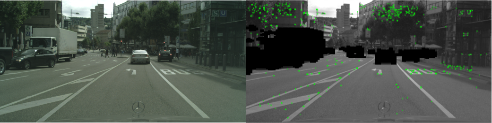

# DDR-SLAM

DDR-SLAM is a Real-time visual SLAM system for Tracking, Mapping and better Localization in Dynamic Scenes.



## Getting Started
* Clone this repo:
```
git clone https://github.com/YznMur/DDRSLAM.git
```
* In [DDR-SLAM-Docker](https://github.com/YznMur/ddr-slam-docker), build  `DDRNetTRT`:
```
  cd ddr_orb2/ddrnet_trt/
  mkdir buildExec
  cd buildExec
  cmake ..
  make -j8
  ./ddrnet -s 
```
* DDRNet_trt weights :  https://drive.google.com/drive/folders/1Dijxp_i5nXrrv0F1GHQthtplL9SmZq04?usp=sharing
* Run in terminal:
```
export LD_LIBRARY_PATH=/root/ddr_orb2/ddrnet_trt/:$LD_LIBRARY_PATH
```
* Go back to `ddr_orb2` directory and build [DDR-SLAM](https://github.com/YznMur/DDRSLAM):
```
./build.sh
```
### Examples on:
* #### [KITTI Dataset:]( http://www.cvlibs.net/datasets/kitti)
```
./scripts/mono_kitti.sh
./scripts/stereo_kitti.sh
```
* #### [Cityscapes Dataset:]( https://www.cityscapes-dataset.com/)
```
./scripts/mono_cs.sh
./scripts/stereo_cs.sh
```
## Acknowledgements
This code is based on a forked version of [ORB-SLAM2](https://github.com/raulmur/ORB_SLAM2) and [DDRNet](https://github.com/ydhongHIT/DDRNet).
